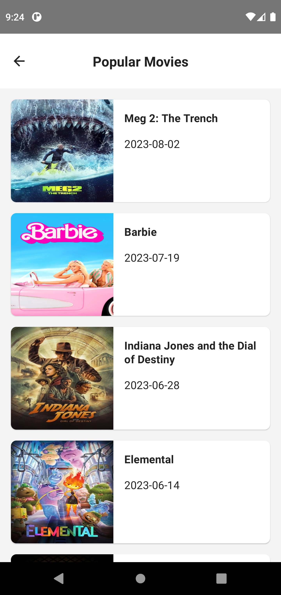
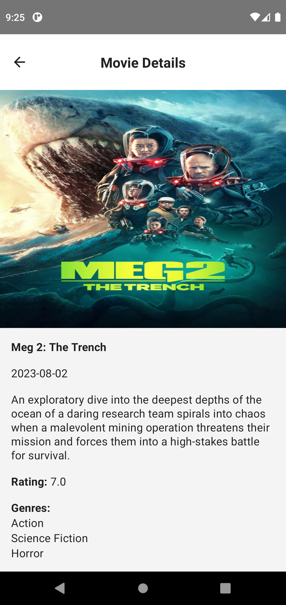

# Movies
This is a sample app that fetches a list of popular movies from The Movie Database (TMDb) API and 
caches the result in a local database. The app uses pagination to load more pages when user scrolls
down the list. When clicking on a specific movie a movie details screen will be shown with more info
about the movie.

#### Screenshots
|                                                               |                                                                  |                                                                         
|---------------------------------------------------------------|------------------------------------------------------------------|
|  |           |

#### Running the project
You must use Gradle JDK 11 to run the project

